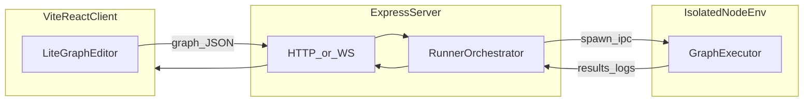

# AGENTS.md — aigraph

This file orients humans and AI assistants working on **aigraph**: an AI execution graph system. Users design graphs in the browser; the **server** runs them in **isolated Node environments** (sandboxing, resource limits, and crash isolation). The **client** is a Vite + React app; the **server** is a Node.js Express app.

## Repository layout (target)

Keep code in predictable places:

| Area | Purpose |
|------|---------|
| `web/` or `client/` | Vite app: React, LiteGraph canvas/editor UI |
| `server/` | Express: HTTP/WebSocket API, runner orchestration |
| `packages/shared/` or `shared/` (optional) | Graph JSON schema/types, serialization helpers, API contracts shared by client and executor |

Avoid scattering graph contracts or duplicate type definitions when a `shared/` package exists.

## Client responsibilities

- **LiteGraph**: register custom node types, load/save graph JSON, editor UX.
- **Server communication**: REST and/or WebSocket for **run**, **stop**, **logs**, and **status**.
- **Execution location**: do not run arbitrary user graph logic in the browser or embed execution secrets there unless that is an explicit product decision. Default: **execution on the server**.

## Server responsibilities

- HTTP API for graph CRUD (if persisted), run lifecycle, and health checks.
- **Spawn and manage** isolated Node workers (implementation may use `child_process`, worker threads, containers, or similar—document the chosen approach in code and update this file when fixed).
- Pass **serialized graph and inputs** into the runner; collect **outputs, errors, and traces**.

## Execution model

## Contracts

- **Serialization**: use LiteGraph’s graph JSON (e.g. `serialize()` / documented JSON shape). Include a **version** field (or equivalent) if the on-wire format evolves.
- **Node parity**: **node type names and IO** must match between editor-registered nodes and server-side executors.

## Conventions

- Use **TypeScript** where applicable; match style in each package.
- Prefer **small, focused diffs**; avoid drive-by refactors unrelated to the task.
- When `shared/` exists, prefer **shared types** for API payloads and graph shape.

## Out of scope / TBD

Update this section when decisions are made:

- Authentication and authorization
- Persistence (database, files, versioning)
- Exact isolation technology (process vs worker vs container) and resource limits
- Rate limiting and multi-tenant boundaries
